# Reproducible Research: Peer Assessment 1


## Loading and preprocessing the data

### 1. Loading the data

```r
fileurl <- "https://d396qusza40orc.cloudfront.net/repdata%2Fdata%2Factivity.zip";
download.file(fileurl,destfile="./repdata-data-activity.zip",method="libcurl");
filename <- unzip(zipfile="./repdata-data-activity.zip");
data_raw <- read.csv(file = filename,header=TRUE,na.strings="NA");
```

### 2. Preprocessing the data

```r
data_processed <- as.data.frame(as.list(with(data_raw, aggregate(x=steps,by=list(date), function(x) {c(Sum=sum(x,na.rm=TRUE),Mean=mean(x,na.rm=TRUE),Median=median(x[x>0],na.rm=TRUE))}))))
names(data_processed) <- c("date","sum","mean","median") 
```

## What is mean total number of steps taken per day?

### 1. The total number of steps per day

```r
library("knitr")
kable(data_processed[,c("date","sum")],format="markdown")
```


|date       |   sum|
|:----------|-----:|
|2012-10-01 |     0|
|2012-10-02 |   126|
|2012-10-03 | 11352|
|2012-10-04 | 12116|
|2012-10-05 | 13294|
|2012-10-06 | 15420|
|2012-10-07 | 11015|
|2012-10-08 |     0|
|2012-10-09 | 12811|
|2012-10-10 |  9900|
|2012-10-11 | 10304|
|2012-10-12 | 17382|
|2012-10-13 | 12426|
|2012-10-14 | 15098|
|2012-10-15 | 10139|
|2012-10-16 | 15084|
|2012-10-17 | 13452|
|2012-10-18 | 10056|
|2012-10-19 | 11829|
|2012-10-20 | 10395|
|2012-10-21 |  8821|
|2012-10-22 | 13460|
|2012-10-23 |  8918|
|2012-10-24 |  8355|
|2012-10-25 |  2492|
|2012-10-26 |  6778|
|2012-10-27 | 10119|
|2012-10-28 | 11458|
|2012-10-29 |  5018|
|2012-10-30 |  9819|
|2012-10-31 | 15414|
|2012-11-01 |     0|
|2012-11-02 | 10600|
|2012-11-03 | 10571|
|2012-11-04 |     0|
|2012-11-05 | 10439|
|2012-11-06 |  8334|
|2012-11-07 | 12883|
|2012-11-08 |  3219|
|2012-11-09 |     0|
|2012-11-10 |     0|
|2012-11-11 | 12608|
|2012-11-12 | 10765|
|2012-11-13 |  7336|
|2012-11-14 |     0|
|2012-11-15 |    41|
|2012-11-16 |  5441|
|2012-11-17 | 14339|
|2012-11-18 | 15110|
|2012-11-19 |  8841|
|2012-11-20 |  4472|
|2012-11-21 | 12787|
|2012-11-22 | 20427|
|2012-11-23 | 21194|
|2012-11-24 | 14478|
|2012-11-25 | 11834|
|2012-11-26 | 11162|
|2012-11-27 | 13646|
|2012-11-28 | 10183|
|2012-11-29 |  7047|
|2012-11-30 |     0|

### 2. Histogram of the total number of steps taken each day

```r
library(ggplot2)
with(data_processed,hist(sum,main="Histogram of the total number of steps taken each day",xlab="steps"))
```

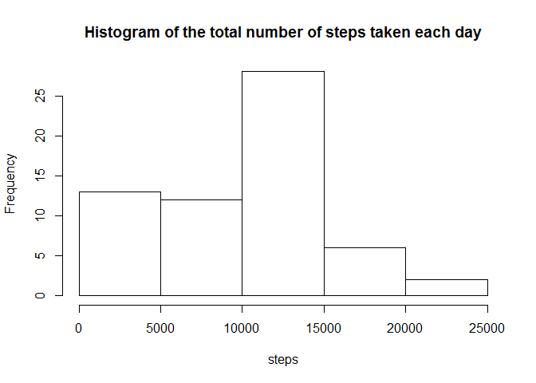 

```r
ggplot(aes(x=as.Date(date),y=sum),data=data_processed)+geom_bar(stat = 'identity', position = 'dodge')+scale_x_date(breaks = '1 day')+theme(axis.text.x = element_text(angle = 90, vjust = 1))+labs(list(title = 'Bar chart of the total number of steps taken each day', x = 'Date', y = 'Steps'))
```

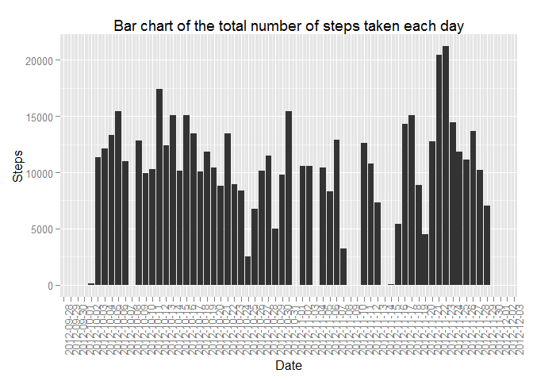 

### 3. Report the mean and median of the total number of steps taken per day

```r
cat("Total Mean is: ",mean(data_processed$sum,na.rm=TRUE))
```

```
## Total Mean is:  9354.23
```

```r
cat("Total Median is: ",median(data_processed$sum,na.rm=TRUE))
```

```
## Total Median is:  10395
```

```r
ggplot(data=data_processed)+geom_point(aes(as.Date(date),mean,colour="Mean"),na.rm=TRUE)+geom_point(aes(as.Date(date),median,colour="Median"),na.rm=TRUE)+scale_x_date(breaks = '1 day')+theme(axis.text.x = element_text(angle = 90, vjust = 1))+scale_fill_discrete(labels=c("trt1","ctrl"))+labs(list(title = 'Mean and Median of the total number of steps taken per day', x = ('Date'), y = 'Values',colour="Legend"))
```

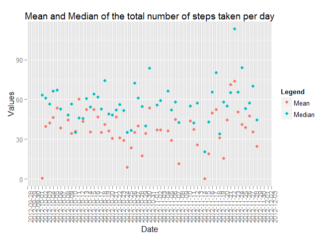 

## What is the average daily activity pattern?

### 1. Time series plot with 5-minute interval and average number of steps taken

```r
data_prc_avg <- as.data.frame(as.list(with(data_raw, aggregate(x=steps,by=list(interval), function(x) {c(Mean=mean(x,na.rm=TRUE))}))))
names(data_prc_avg) <- c("interval","average")
ggplot(data=data_prc_avg,aes(x=interval,y=average))+geom_line()+labs(list(title = 'Average number of steps per interval', x = 'Interval', y = 'Average number of steps'))
```

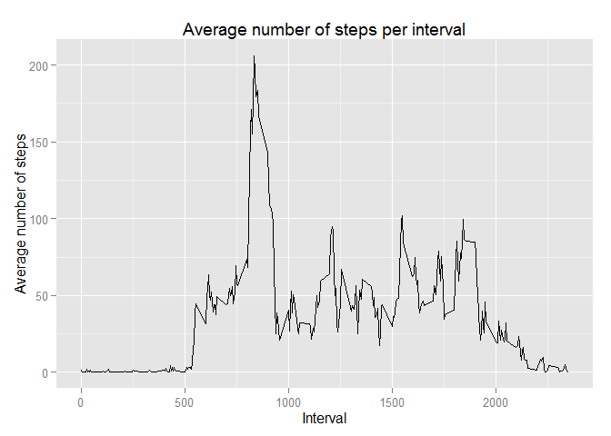 

### 2. Which time-interval contains the maximum number of steps

```r
data_prc_avg[which.max(data_prc_avg$average),]
```

```
##     interval  average
## 104      835 206.1698
```

## Imputing missing values

### 1. Total number of missing values in the dataset


```r
length(which(is.na(data_raw$steps)))
```

```
## [1] 2304
```

### 2 & 3. Filling Missing values in the dataset

```r
data_replaced <- merge(x=merge(x = data_raw, y = data_processed, by = "date", all = TRUE),y=data_prc_avg,by="interval",all=TRUE)
data_replaced$steps_rep_mean <- ifelse(is.na(data_replaced$steps),data_replaced$mean,data_replaced$steps)
data_replaced$steps_rep_median <- ifelse(is.na(data_replaced$steps),data_replaced$median,data_replaced$steps)
data_replaced$steps_rep_average <- ifelse(is.na(data_replaced$steps),data_replaced$average,data_replaced$steps)
```

1. Histogram of the total number of steps taken each day replacing missing values with mean

```r
data_rep_mean <- as.data.frame(as.list(with(data_replaced, aggregate(x=steps_rep_mean,by=list(date), function(x) {c(Sum=sum(x,na.rm=TRUE),Mean=mean(x,na.rm=TRUE),Median=median(x[x>0],na.rm=TRUE))}))))
names(data_rep_mean) <- c("date","sum","mean","median") 
```

        . The total number of steps per day

```r
library("knitr")
kable(data_rep_mean[,c("date","sum")],format="markdown")
```


|date       |   sum|
|:----------|-----:|
|2012-10-01 |     0|
|2012-10-02 |   126|
|2012-10-03 | 11352|
|2012-10-04 | 12116|
|2012-10-05 | 13294|
|2012-10-06 | 15420|
|2012-10-07 | 11015|
|2012-10-08 |     0|
|2012-10-09 | 12811|
|2012-10-10 |  9900|
|2012-10-11 | 10304|
|2012-10-12 | 17382|
|2012-10-13 | 12426|
|2012-10-14 | 15098|
|2012-10-15 | 10139|
|2012-10-16 | 15084|
|2012-10-17 | 13452|
|2012-10-18 | 10056|
|2012-10-19 | 11829|
|2012-10-20 | 10395|
|2012-10-21 |  8821|
|2012-10-22 | 13460|
|2012-10-23 |  8918|
|2012-10-24 |  8355|
|2012-10-25 |  2492|
|2012-10-26 |  6778|
|2012-10-27 | 10119|
|2012-10-28 | 11458|
|2012-10-29 |  5018|
|2012-10-30 |  9819|
|2012-10-31 | 15414|
|2012-11-01 |     0|
|2012-11-02 | 10600|
|2012-11-03 | 10571|
|2012-11-04 |     0|
|2012-11-05 | 10439|
|2012-11-06 |  8334|
|2012-11-07 | 12883|
|2012-11-08 |  3219|
|2012-11-09 |     0|
|2012-11-10 |     0|
|2012-11-11 | 12608|
|2012-11-12 | 10765|
|2012-11-13 |  7336|
|2012-11-14 |     0|
|2012-11-15 |    41|
|2012-11-16 |  5441|
|2012-11-17 | 14339|
|2012-11-18 | 15110|
|2012-11-19 |  8841|
|2012-11-20 |  4472|
|2012-11-21 | 12787|
|2012-11-22 | 20427|
|2012-11-23 | 21194|
|2012-11-24 | 14478|
|2012-11-25 | 11834|
|2012-11-26 | 11162|
|2012-11-27 | 13646|
|2012-11-28 | 10183|
|2012-11-29 |  7047|
|2012-11-30 |     0|


        . Histogram of the total number of steps taken each day 

```r
with(data_rep_mean,hist(sum,main="Histogram of the total number of steps taken each day \n replacing missing values with mean for that day",xlab="steps"))
```

 

```r
ggplot(aes(x=as.Date(date),y=sum),data=data_rep_mean)+geom_bar(stat = 'identity', position = 'dodge')+scale_x_date(breaks = '1 day')+theme(axis.text.x = element_text(angle = 90, vjust = 1))+labs(list(title = 'Bar chart of the total number of steps taken each day \n replacing missing values with mean for that day', x = 'Date', y = 'Steps'))
```

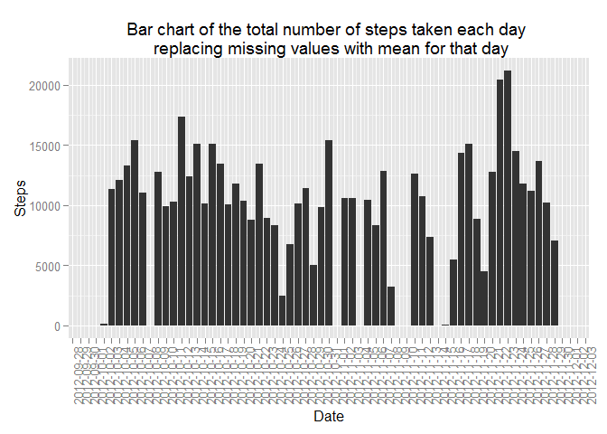 

        . Report the mean and median of the total number of steps taken per day

```r
cat("Total Mean is: ",mean(data_rep_mean$sum,na.rm=TRUE))
```

```
## Total Mean is:  9354.23
```

```r
cat("Total Median is: ",median(data_rep_mean$sum,na.rm=TRUE))
```

```
## Total Median is:  10395
```

```r
ggplot(data=data_rep_mean)+geom_point(aes(as.Date(date),mean,colour="Mean"),na.rm=TRUE)+geom_point(aes(as.Date(date),median,colour="Median"),na.rm=TRUE)+scale_x_date(breaks = '1 day')+theme(axis.text.x = element_text(angle = 90, vjust = 1))+scale_fill_discrete(labels=c("trt1","ctrl"))+labs(list(title = 'Mean and Median of the total number of steps taken per day \n replacing missing values with mean for that day', x = ('Date'), y = 'Values',colour="Legend"))
```

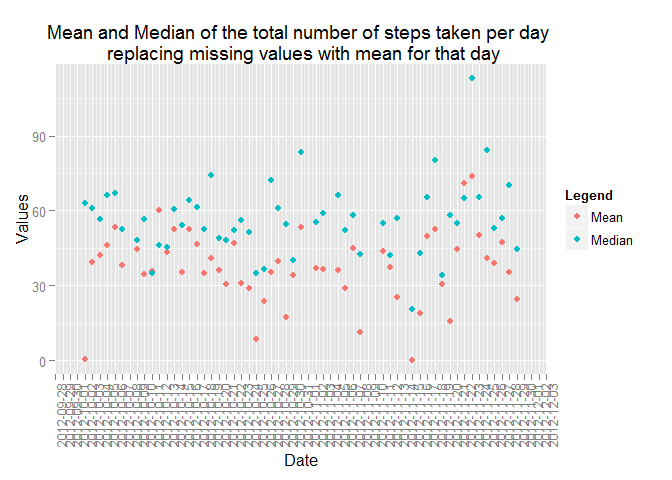 

2. Histogram of the total number of steps taken each day replacing missing values with median

```r
data_rep_median <- as.data.frame(as.list(with(data_replaced, aggregate(x=steps_rep_median,by=list(date), function(x) {c(Sum=sum(x,na.rm=TRUE),Mean=mean(x,na.rm=TRUE),Median=median(x[x>0],na.rm=TRUE))}))))
names(data_rep_median) <- c("date","sum","mean","median") 
```

        . The total number of steps per day

```r
library("knitr")
kable(data_rep_median[,c("date","sum")],format="markdown")
```


|date       |   sum|
|:----------|-----:|
|2012-10-01 |     0|
|2012-10-02 |   126|
|2012-10-03 | 11352|
|2012-10-04 | 12116|
|2012-10-05 | 13294|
|2012-10-06 | 15420|
|2012-10-07 | 11015|
|2012-10-08 |     0|
|2012-10-09 | 12811|
|2012-10-10 |  9900|
|2012-10-11 | 10304|
|2012-10-12 | 17382|
|2012-10-13 | 12426|
|2012-10-14 | 15098|
|2012-10-15 | 10139|
|2012-10-16 | 15084|
|2012-10-17 | 13452|
|2012-10-18 | 10056|
|2012-10-19 | 11829|
|2012-10-20 | 10395|
|2012-10-21 |  8821|
|2012-10-22 | 13460|
|2012-10-23 |  8918|
|2012-10-24 |  8355|
|2012-10-25 |  2492|
|2012-10-26 |  6778|
|2012-10-27 | 10119|
|2012-10-28 | 11458|
|2012-10-29 |  5018|
|2012-10-30 |  9819|
|2012-10-31 | 15414|
|2012-11-01 |     0|
|2012-11-02 | 10600|
|2012-11-03 | 10571|
|2012-11-04 |     0|
|2012-11-05 | 10439|
|2012-11-06 |  8334|
|2012-11-07 | 12883|
|2012-11-08 |  3219|
|2012-11-09 |     0|
|2012-11-10 |     0|
|2012-11-11 | 12608|
|2012-11-12 | 10765|
|2012-11-13 |  7336|
|2012-11-14 |     0|
|2012-11-15 |    41|
|2012-11-16 |  5441|
|2012-11-17 | 14339|
|2012-11-18 | 15110|
|2012-11-19 |  8841|
|2012-11-20 |  4472|
|2012-11-21 | 12787|
|2012-11-22 | 20427|
|2012-11-23 | 21194|
|2012-11-24 | 14478|
|2012-11-25 | 11834|
|2012-11-26 | 11162|
|2012-11-27 | 13646|
|2012-11-28 | 10183|
|2012-11-29 |  7047|
|2012-11-30 |     0|


        . Histogram of the total number of steps taken each day 

```r
with(data_rep_median,hist(sum,main="Histogram of the total number of steps taken each day \n replacing missing values with median for that day",xlab="steps"))
```

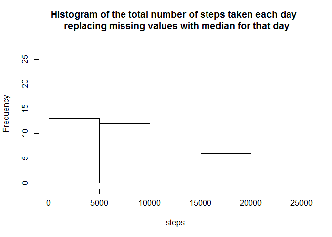 

```r
ggplot(aes(x=as.Date(date),y=sum),data=data_rep_median)+geom_bar(stat = 'identity', position = 'dodge')+scale_x_date(breaks = '1 day')+theme(axis.text.x = element_text(angle = 90, vjust = 1))+labs(list(title = 'Bar chart of the total number of steps taken each day \n replacing missing values with median for that day', x = 'Date', y = 'Steps'))
```

 

        . Report the mean and median of the total number of steps taken per day

```r
cat("Total Mean is: ",mean(data_rep_median$sum,na.rm=TRUE))
```

```
## Total Mean is:  9354.23
```

```r
cat("Total Median is: ",median(data_rep_median$sum,na.rm=TRUE))
```

```
## Total Median is:  10395
```

```r
ggplot(data=data_rep_median)+geom_point(aes(as.Date(date),mean,colour="Mean"),na.rm=TRUE)+geom_point(aes(as.Date(date),median,colour="Median"),na.rm=TRUE)+scale_x_date(breaks = '1 day')+theme(axis.text.x = element_text(angle = 90, vjust = 1))+scale_fill_discrete(labels=c("trt1","ctrl"))+labs(list(title = 'Mean and Median of the total number of steps taken per day \n replacing missing values with median for that day', x = ('Date'), y = 'Values',colour="Legend"))
```

 

3. Histogram of the total number of steps taken each day replacing missing values with average

```r
data_rep_average <- as.data.frame(as.list(with(data_replaced, aggregate(x=steps_rep_average,by=list(date), function(x) {c(Sum=sum(x,na.rm=TRUE),Mean=mean(x,na.rm=TRUE),Median=median(x[x>0],na.rm=TRUE))}))))
names(data_rep_average) <- c("date","sum","mean","median") 
```

        . The total number of steps per day        

```r
library("knitr") 
kable(data_rep_average[,c("date","sum")],format="markdown") 
```


|date       |      sum|
|:----------|--------:|
|2012-10-01 | 10766.19|
|2012-10-02 |   126.00|
|2012-10-03 | 11352.00|
|2012-10-04 | 12116.00|
|2012-10-05 | 13294.00|
|2012-10-06 | 15420.00|
|2012-10-07 | 11015.00|
|2012-10-08 | 10766.19|
|2012-10-09 | 12811.00|
|2012-10-10 |  9900.00|
|2012-10-11 | 10304.00|
|2012-10-12 | 17382.00|
|2012-10-13 | 12426.00|
|2012-10-14 | 15098.00|
|2012-10-15 | 10139.00|
|2012-10-16 | 15084.00|
|2012-10-17 | 13452.00|
|2012-10-18 | 10056.00|
|2012-10-19 | 11829.00|
|2012-10-20 | 10395.00|
|2012-10-21 |  8821.00|
|2012-10-22 | 13460.00|
|2012-10-23 |  8918.00|
|2012-10-24 |  8355.00|
|2012-10-25 |  2492.00|
|2012-10-26 |  6778.00|
|2012-10-27 | 10119.00|
|2012-10-28 | 11458.00|
|2012-10-29 |  5018.00|
|2012-10-30 |  9819.00|
|2012-10-31 | 15414.00|
|2012-11-01 | 10766.19|
|2012-11-02 | 10600.00|
|2012-11-03 | 10571.00|
|2012-11-04 | 10766.19|
|2012-11-05 | 10439.00|
|2012-11-06 |  8334.00|
|2012-11-07 | 12883.00|
|2012-11-08 |  3219.00|
|2012-11-09 | 10766.19|
|2012-11-10 | 10766.19|
|2012-11-11 | 12608.00|
|2012-11-12 | 10765.00|
|2012-11-13 |  7336.00|
|2012-11-14 | 10766.19|
|2012-11-15 |    41.00|
|2012-11-16 |  5441.00|
|2012-11-17 | 14339.00|
|2012-11-18 | 15110.00|
|2012-11-19 |  8841.00|
|2012-11-20 |  4472.00|
|2012-11-21 | 12787.00|
|2012-11-22 | 20427.00|
|2012-11-23 | 21194.00|
|2012-11-24 | 14478.00|
|2012-11-25 | 11834.00|
|2012-11-26 | 11162.00|
|2012-11-27 | 13646.00|
|2012-11-28 | 10183.00|
|2012-11-29 |  7047.00|
|2012-11-30 | 10766.19|


        . Histogram of the total number of steps taken each day 

```r
with(data_rep_average,hist(sum,main="Histogram of the total number of steps taken each day \n replacing missing values with average for that interval",xlab="steps"))
```

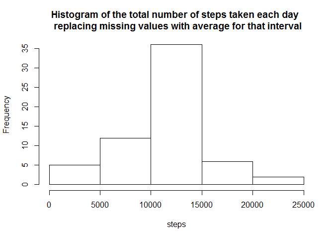 

```r
ggplot(aes(x=as.Date(date),y=sum),data=data_rep_average)+geom_bar(stat = 'identity', position = 'dodge')+scale_x_date(breaks = '1 day')+theme(axis.text.x = element_text(angle = 90, vjust = 1))+labs(list(title = 'Bar chart of the total number of steps taken each day \n replacing missing values with average for that interval', x = 'Date', y = 'Steps'))
```

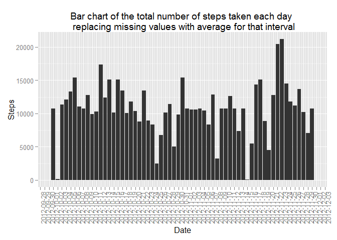 

        . Report the mean and median of the total number of steps taken per day

```r
cat("Total Mean is: ",mean(data_rep_average$sum,na.rm=TRUE))
```

```
## Total Mean is:  10766.19
```

```r
cat("Total Median is: ",median(data_rep_average$sum,na.rm=TRUE))
```

```
## Total Median is:  10766.19
```

```r
ggplot(data=data_rep_average)+geom_point(aes(as.Date(date),mean,colour="Mean"),na.rm=TRUE)+geom_point(aes(as.Date(date),median,colour="Median"),na.rm=TRUE)+scale_x_date(breaks = '1 day')+theme(axis.text.x = element_text(angle = 90, vjust = 1))+scale_fill_discrete(labels=c("trt1","ctrl"))+labs(list(title = 'Mean and Median of the total number of steps taken per day \n replacing missing values with average for that interval', x = ('Date'), y = 'Values',colour="Legend"))
```

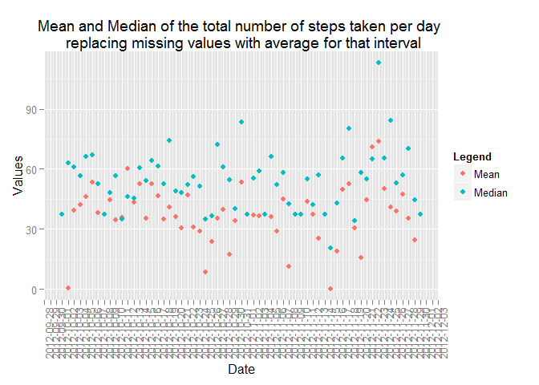 

#### Conclusion: 
There is no impact on missing values if we replace missing values with mean or median calculated per day. But if we replace with average of the interval, I see a total number of steps increased per day. 

## Are there differences in activity patterns between weekdays and weekends?

```r
data_replaced$wend <- as.factor(ifelse(weekdays(as.Date(data_replaced$date)) %in% c("Saturday","Sunday"), "Weekend", "Weekday"))
data_prc_avg <- as.data.frame(as.list(with(data_replaced, aggregate(x=steps_rep_average,by=list(interval,wend), function(x) {c(Mean=mean(x,na.rm=TRUE))}))))
names(data_prc_avg) <- c("interval","wend","average")
ggplot(data=data_prc_avg,aes(interval,average))+geom_line(col="blue")+labs(list(title = 'Comparision between weekday and weekend', x = 'Interval', y = 'Number of steps'))+facet_grid(wend ~ .)
```

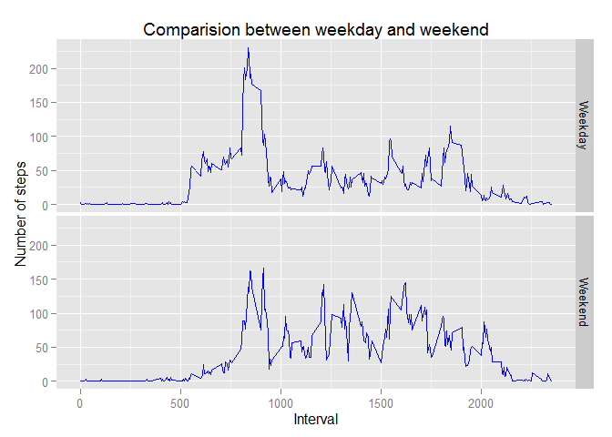 

#### Conclusion: During weekends the number of steps on average are high between 10 to 20 hours
